# Tarea #4, Modelos probabilisticos de señales y sistemas IE-0405

Estudiante: Ignacio Mora Calderon, B64657  
I-Semestre, 2020

## Pregunta #1

Un esquema de modulación BPSK(Binary Phase Shift Keying) es una forma de modulación angular que consiste en hacer variar la fase de la portadora entre un número determinado de valores discretos, en este caso al ser binario los simbolos son 1 y 0 por lo cual el cambio de fase es de 180 grados.
En el caso del problema presentado se necesitan modular 10000 bits del archivo bit10k.csv con una frecuencia para la senal portadora de 5000 Hz. Se utilizan 50 puntos para realizar la grafica de la portadora y para cada bit modulado dentro de la senal final, para asegurar no tener perdidas y poder reconstruir la senal continua de forma discreta en la computadora. A continuacion se presenta la forma de onda de la portadora sin desfase asi como de la senal obtenida al realizar la modulacion para los primeros 10 bits:

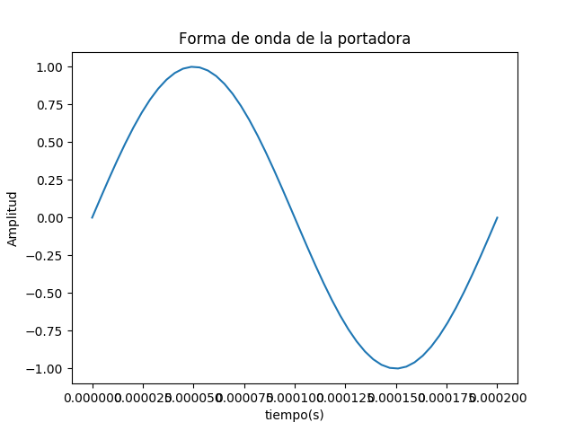
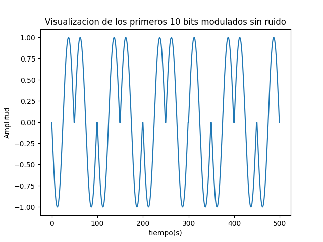

## Pregunta #2

Para realizar el calculo de la potencia promedio se usa la siguiente formula para la potencia promedio de un proceso estocastico, con el metodo integrate de scipy.
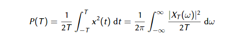  
Dando como resultado el siguiente valor:  
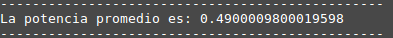 

## Pregunta #3

Para simular un canal ruidoso del tipo AWGN (ruido aditivo blanco gaussiano) con una relación señal a ruido (SNR) dada primero se debe encontrar el sigma que proporciona ese valor para SNR por medio de las siguientes ecuaciones:  
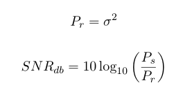  
Al despejar la potencia del ruido requerida de la segunda ecuacion, podemos obtener el valor para sigma de la primera.  
En el caso del problema propuesto, era necesario simular un canal ruidoso con valores de SNR desde -2 hasta 3 dB. Para generar el ruido se usa el metodo de random.normal de numpy.A continuacion se presentan los graficos obtenidos para cada SNR:

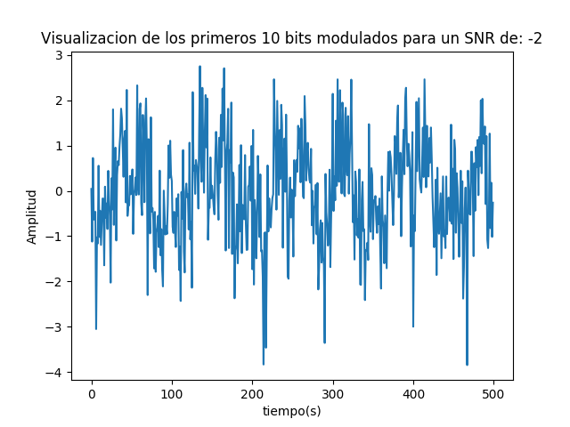
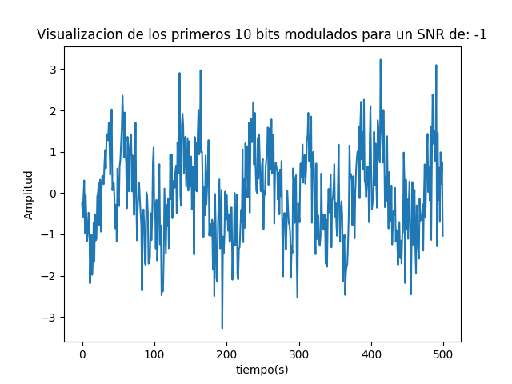
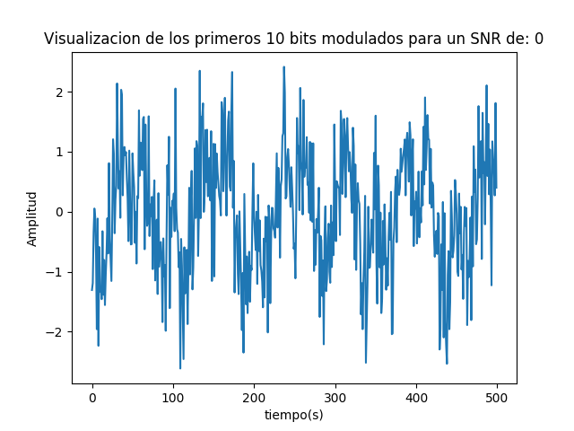
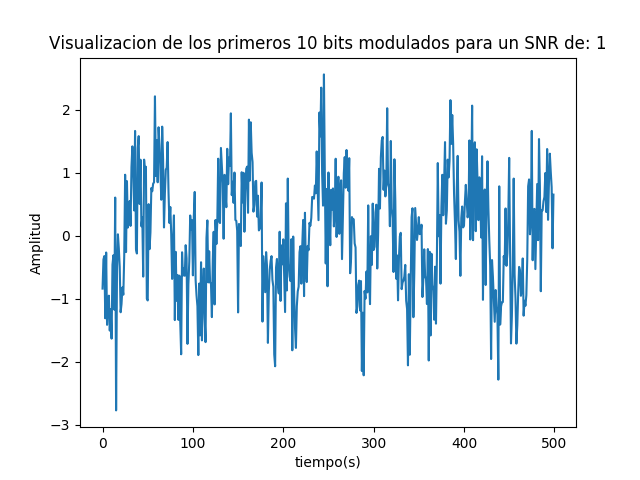
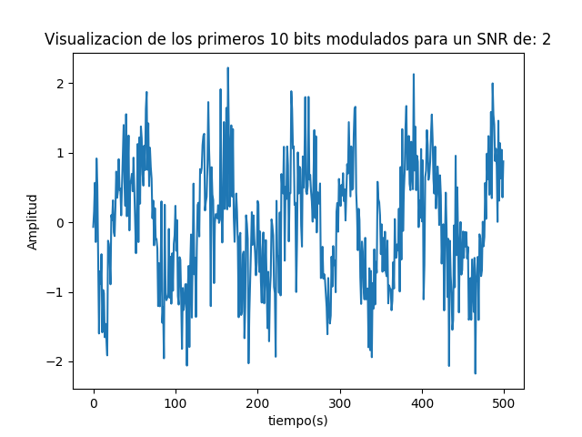
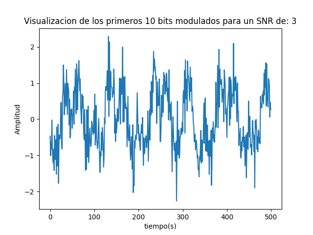

## Pregunta #4
Para graficar la densidad espectral de potencia de la señales se utilizo el metodo Welch de scipy. Primero se muestra el grafico antes del canal ruidoso: 
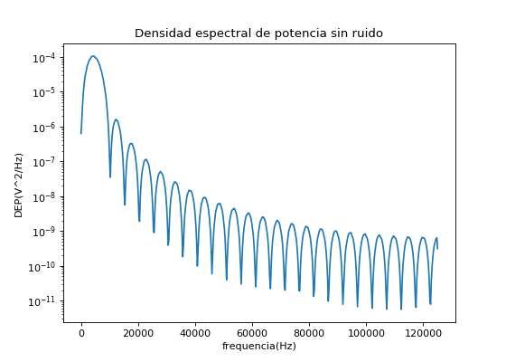  
Ahora se muestran los graficos con el canal ruidoso para cada valor de SNR:  
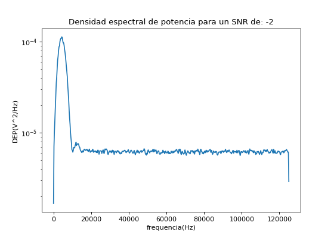
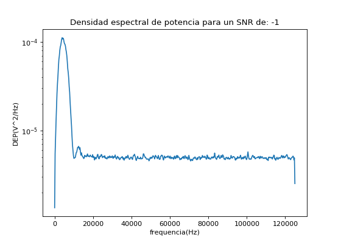
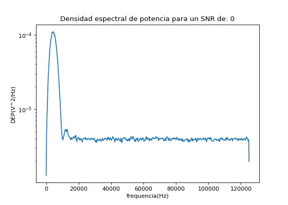
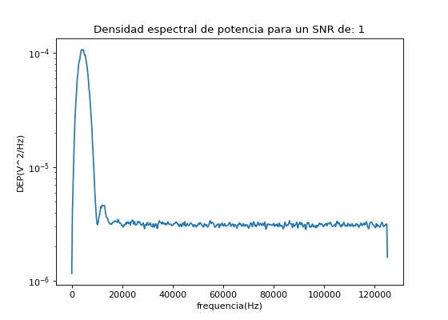
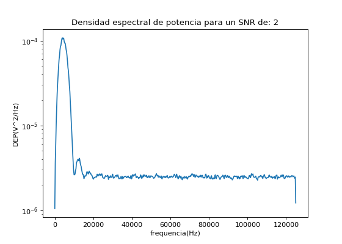
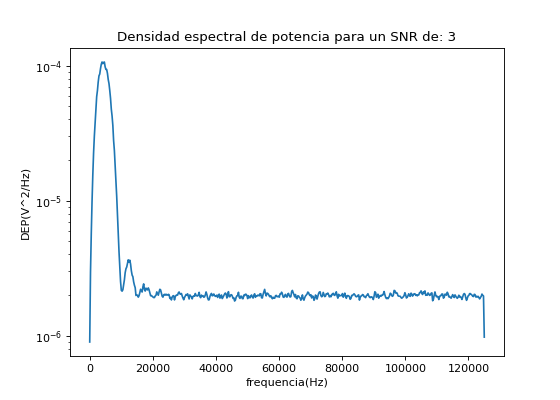

## Pregunta #5
Para demodular las senales de los canales que llegan al receptor se utiliza un analisis de energias. Primero se calcula la potencia instantanea de la senal portadora con lo cual luego se va analizando la potencia de la senal proveniente para cada ciclo multiplicando el segmento de la senal a analizar por la senal portadora sin ruido, asi podemos diferenciar si la informacion entrante se trata de un 1 o un 0. El umbral escogido para considerar el dato 1 es que la potencia del segmento de la senal sea mayor a la mitad de la potencia instantanea de la portadora, si es menor a ese valor se lee como un 0. A continuacion se presentan los resultados de los errores provocados al realizar la demodulacion para las senales provenientes de los canales con distintos valores de SNR, ademas se incluye el BER(Bit Error Rate) para cada caso:  
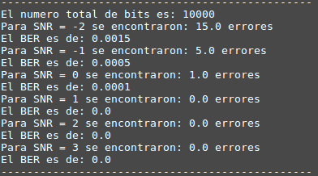 

Como era de esperar para valores mas bajos de SNR se provocan mas errores ya que el ruido es mas fuerte para estos casos.

## Pregunta #6

A continuacion se presenta de forma grafica la informacion de la parte anterior con un grafico de BER vs SNR:  
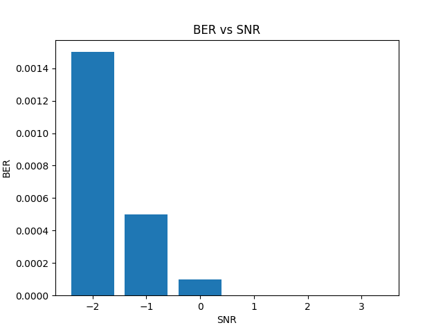 

